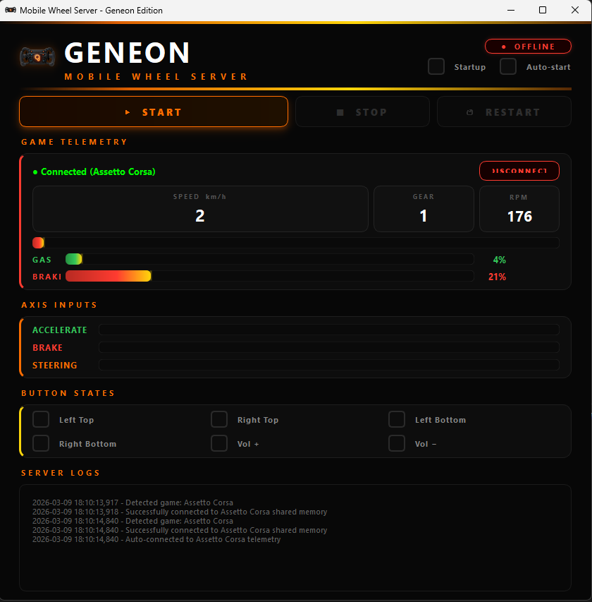
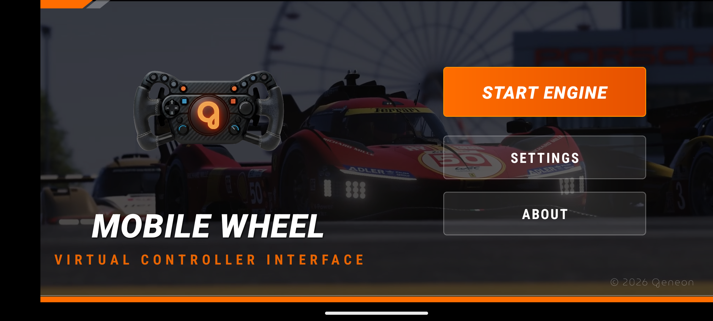
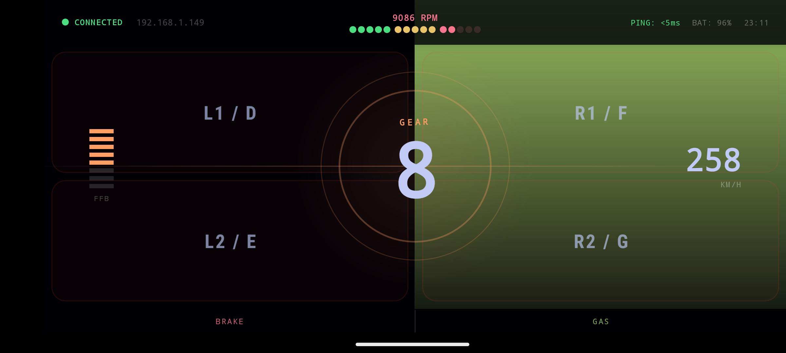
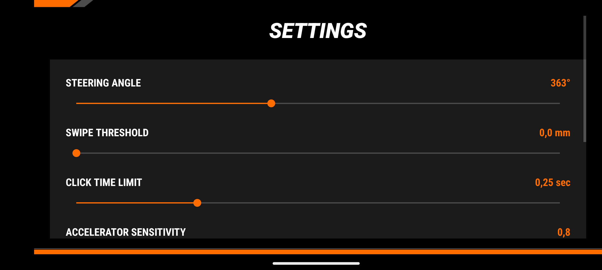

# MobilWheel
An app that simulates your phone as a steering wheel for PC.

# Python Server

The Python server in this project monitors commands sent from the client application and displays the corresponding logs in real-time. The server runs a graphical interface that allows you to start and stop the server, observe the status of various input commands (such as acceleration, braking, and steering), and view a live log of all actions performed by the server. 

Advanced features include real-time telemetry integration with popular racing simulators, allowing live feedback to your mobile device with essential driving metrics such as gear position, speed, throttle percentage, brake pressure, and race status information. This setup provides a straightforward way to manage and monitor the communication between the client and server.

# Android Client

### Menu
The main menu of the application provides a clean and user-friendly interface where users can easily navigate the core functionalities.

### Wheel

This interface allows users to control and monitor their driving inputs using their mobile device. The key features include:

- Accelerate and Brake: Users can press designated areas on the screen to accelerate or brake, with visual indicators showing the intensity of each action.
- Steering Control: The layout uses the device's motion sensors to interpret the tilt of the phone as steering input, allowing the user to steer as if turning a wheel.
- Button Controls: The screen includes four large buttons (Left Top, Left Bottom, Right Top, Right Bottom) and two extra buttons (Volume Up, Volume Down) for additional controls, which can be customized for different actions.

### Settings

This interface allows users to fine-tune various controls and sensitivities related to their driving experience. The settings available include:

- **Steering Angle:** Adjust the maximum steering angle using a slider. The current angle is displayed next to the slider.
- **Swipe Threshold:** Modify the swipe threshold, which determines how far the user needs to swipe to trigger an action. The threshold is adjustable via a slider, and the current value is shown in millimeters.
- **Click Time Limit:** Set the time limit for recognizing a click action, allowing users to control how quickly a tap is registered. The slider adjusts the time limit, and the current value is displayed in seconds.
- **Brake Sensitivity:** Modify the sensitivity of the brake pedal, similar to the accelerator settings. The slider controls the sensitivity, and the current value is displayed.

## Telemetry & Game Integration

MobilWheel now includes advanced telemetry capabilities that provide real-time feedback directly to your mobile device while racing or driving in supported simulators. This feature transforms your phone into an interactive dashboard with live performance metrics.

### Supported Racing Simulators

- **Assetto Corsa** - Full telemetry support with detailed car and track information
- **Assetto Corsa Competizione** - Enhanced telemetry integration for competitive racing
- **iRacing** - Complete shared memory telemetry access 
- **Le Mans Ultimate** - Real-time vehicle dynamics and race data

### Live Telemetry Indicators

The telemetry system provides drivers with essential real-time information:

- **Gear Position** - Current gear selection with visual indicator
- **Speed** - Real-time vehicle speed in km/h or mph
- **RPM** - Engine revolutions per minute with redline warning
- **Throttle Position** - Percentage of throttle input (0-100%)
- **Brake Pressure** - Current brake application level
- **Steering Input** - Steering angle and input percentage
- **Lap Time** - Current lap time and sector times
- **Race Status** - Position in race, lap count, fuel and tire information
- **Track Temperature** - Ambient and track temperature data
- **Traction Control/ABS Status** - Active assistance systems status

### How It Works

The Python server continuously reads telemetry data from the racing simulator through shared memory buffers or network protocols. This data is processed and sent to your Android device in real-time, updating the mobile display with current race conditions and vehicle performance metrics. The telemetry dashboard allows drivers to monitor critical information without taking their eyes off the road or simulator screen.
